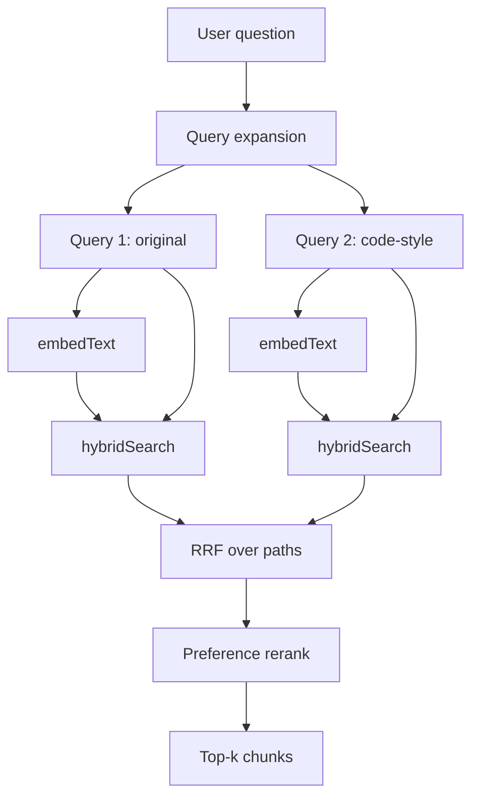

# GitAsk

Just a simple, browser-based RAG engine.

It turns any GitHub repo into a local AI assistant. Everything runs right on your device (WebGPU). no servers, no API keys, no costs.

Here's how it works:

## Retrieval (CodeRAG-style)

We use multi-query expansion and multi-path retrieval with preference reranking:

## How to run it

1. **Install**: `npm install`
2. **Start**: `npm run dev`
3. **Go**: Open `localhost:3000` and paste a GitHub URL.

that's it. hf.

## References

- **CodeRAG:** Zhang et al., *Finding Relevant and Necessary Knowledge for Retrieval-Augmented Repository-Level Code Completion*, EMNLP 2025. [arXiv:2509.16112](https://arxiv.org/abs/2509.16112)
- **CoVE:** Dhuliawala et al., *Chain-of-Verification Reduces Hallucination in Large Language Models*, Findings of ACL 2024. [arXiv:2309.11495](https://arxiv.org/abs/2309.11495)
